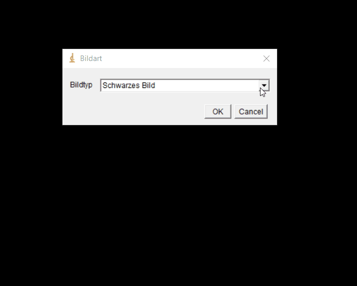
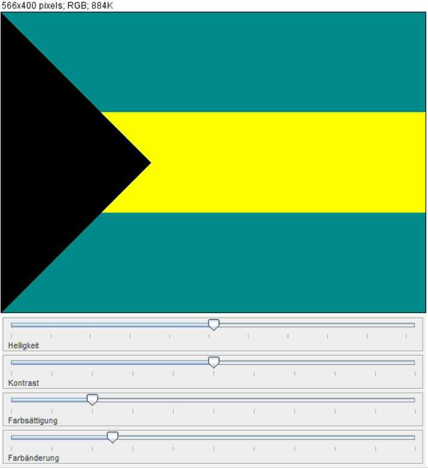
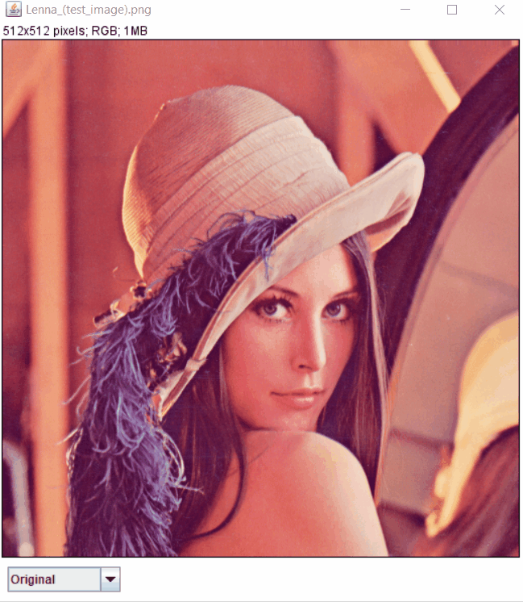
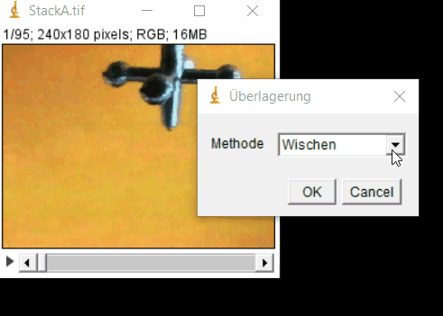
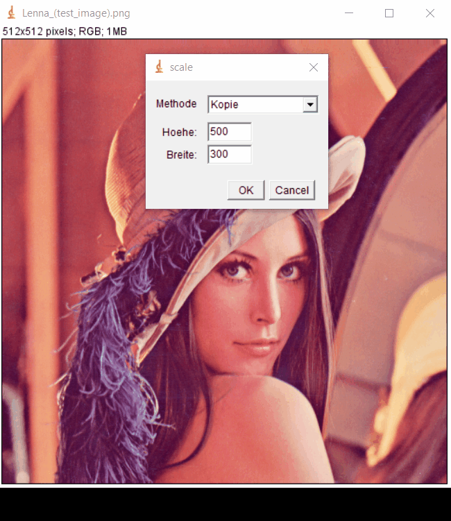

# Digital Media Basics

## Laboratory Exercises - ImageJ Plugins

done during the course _Digital Media Bascis_ at HTW Berlin in the summersemester 2018

### 1: Image generating

### 2: Color modification and transformation of an image

### 3: Image processing

### 4: Video overlay

### 5: Linear filters

### 6: Bilinear interpolation

